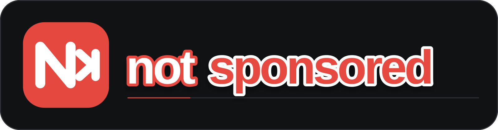

# notsponsored

**notsponsored** skips sponsor reads on YouTube. It checks the SponsorBlock API first and can fall back to looking for
sponsors using the video's captions when no community segment is available.

### But Why?

The goal of this extension is to make it possible to automatically skip sponsors on YouTube without having to rely on a
community database. SponsorBlock is great (and the API is actually used in this project), but it doesn't have every
video
covered yet. This leads to new or unpopular videos not containing any community entries, making an automatic skip
impossible. This extension can detect sponsors, affiliate links, and self promotions in videos that haven't been
submitted to SponsorBlock yet using a local
detection algoritm and a LLM (optional).

## Demo

  
<b>Click to view the video demo</b>

   

  

    <video src="https://github.com/user-attachments/assets/39e83727-ad91-477d-84b7-a84f7dbe0460" width="100%" controls></video>
  

___

## What it does

- Marks detected sponsor segments on the YouTube timeline.
- Skips detected segments and gives you an **Undo** button for rewinding the skip.
- Lets you choose the detection mode - between SponsorBlock, local detection, or both (local detection as a fallback).
- Can stop scanning individual channels for sponsors.
- Has a cool statistics card that gives you insights on how many sponsors you've skipped and how much time you've saved.
- Includes an adjustable start and end trim setting.
- Can seek YouTube ads to the end. This is optional and can be turned off in the popup.

___

## Detection modes

- **Local only** checks the video's captions without querying SponsorBlock.
- **Local fallback** tries SponsorBlock first, then checks the captions if SponsorBlock has no segment. This is the
  default.
- **SponsorBlock only** uses community-submitted sponsor segments and does not run the local detector.

The local detector is useful when a video has not been submitted to SponsorBlock yet, but it is still a best-effort text
detector. It needs usable English captions to function properly and will not catch every sponsor read.
___

## Install from source

**For now, the extension is only available from source, so that means Firefox users cannot have the extension persist
across restarts. I will eventually publish it to the Firefox Web Store so it can be persisted. I'll only publish it to
the
Chrome web store if the extension gets enough Github stars and users, as I don't want to pay the $5 publishing fee for
no reason. Sorry for the inconvenience!**

### Chrome

1. Download or clone this repository.
2. Open `chrome://extensions` in Chrome.
3. Turn on **Developer mode**.
4. Click **Load unpacked** and select the repository folder.

### Firefox (temporary)

1. Download or clone this repository.
2. Open `about:debugging#/runtime/this-firefox` in Firefox.
3. Click **Load Temporary Add-on** and select any file in the repository folder.

___

## LLM verification

LLM verification is an optional feature that helps improve the accuracy of the local detection algorithm. It uses the
LLM to verify the local detection results and find sponsor segments.
It is off by default, and if you choose to enable it, you can use an OpenAI-compatible endpoint and choose a model to
start using it. Keep in mind that this obviously costs API tokens, so if you want this for free, choose an API provider
with a free tier, such as [openrouter](https://openrouter.ai/). The endpoint, model, and API key that you enter are
stored in browser `localstorage`, and the extension requests permission for that provider’s origin.
___

## Limitations

- Videos without usable captions (english) depend on SponsorBlock only, since both the local and LLM detectors need
  caption text.
- The YouTube ad skipping feature seeks to the end of an ad, so you still need to click "Skip" to move to the next
  ad/video. It isn't a network ad blocker, so it won't block ads from loading.
